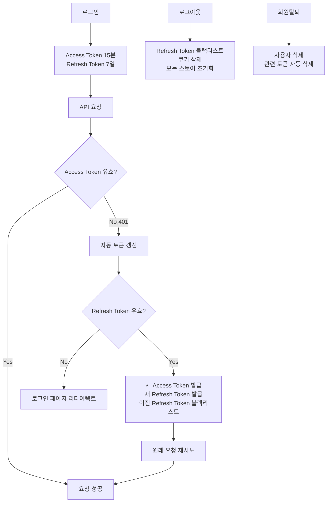

# GoBooky 프로젝트 JWT 관리 흐름 분석

## 📋 개요

GoBooky 프로젝트는 **Access Token (메모리) + Refresh Token (HttpOnly 쿠키) + Redis 블랙리스트** 아키텍처를 채택하여 SPA 환경에서 안전하고 사용자 친화적인 JWT 인증 시스템을 구현하고 있습니다.

## 🏗️ 아키텍처 구성

| 구성 요소         | 저장 위치            | 수명     | 역할                                  |
| ----------------- | -------------------- | -------- | ------------------------------------- |
| **Access Token**  | Pinia Store (메모리) | 15분     | API 요청 시 Authorization 헤더에 사용 |
| **Refresh Token** | HttpOnly 쿠키        | 7일      | Access Token 갱신용                   |
| **블랙리스트**    | Redis (jti 기반)     | TTL 관리 | 로그아웃/회원탈퇴 시 즉시 토큰 무효화 |

## 🔄 주요 흐름 분석

### 1. 로그인 흐름

#### 프론트엔드 (Vue 3)

```javascript
// useAuth.js - login 함수
const login = async (email, password) => {
  const response = await authAPI.login(email, password);
  await authStore.setAuth(response.access, response.user);
  sessionStorage.setItem("gobooky-visited", "true");
};
```

#### 백엔드 (Django)

```python
# jwt_views.py - CustomTokenObtainPairView
class CustomTokenObtainPairView(TokenObtainPairView):
    def post(self, request, *args, **kwargs):
        response = super().post(request, *args, **kwargs)

        # Refresh token을 HttpOnly 쿠키로 설정
        refresh_token = data.get("refresh")
        response.set_cookie(
            settings.SIMPLE_JWT["AUTH_COOKIE_REFRESH"],  # "gobooky-refresh"
            refresh_token,
            max_age=settings.SIMPLE_JWT["REFRESH_TOKEN_LIFETIME"].total_seconds(),
            httponly=True,
            secure=False,  # 개발환경
            samesite="Lax",
            path="/",
        )

        # 응답에서 refresh token 제거 (쿠키로만 전송)
        del data["refresh"]
```

**흐름:**

1. 사용자가 이메일/비밀번호 입력
2. `/auth/jwt/login/` POST 요청
3. 서버에서 Access + Refresh 토큰 생성
4. Access Token은 JSON 응답으로 반환
5. Refresh Token은 HttpOnly 쿠키로 설정
6. 프론트엔드에서 Access Token을 Pinia Store에 저장
7. `sessionStorage`에 방문 기록 저장

### 2. 브라우저 새로고침 흐름

#### 앱 초기화 (main.js)

```javascript
// main.js - 부트스트랩 게이트 패턴
async function initializeApp() {
  await authGate(router); // 라우터 마운트 전에 세션 복구
  app.use(router);
}
```

#### 인증 게이트 (authGate.js)

```javascript
// bootstrap/authGate.js
export async function authGate(router) {
  const authStore = useAuthStore();
  const isAuthenticated = await authStore.initAuth();

  // 라우터 가드 설정
  router.beforeEach(async (to, from, next) => {
    if (to.meta?.requiresAuth && !authStore.isAuthenticated) {
      const refreshSuccess = await authStore.silentRefresh();
      if (!refreshSuccess) {
        next({ name: "Login", query: { redirect: to.fullPath } });
        return;
      }
    }
    next();
  });
}
```

#### 세션 복구 로직 (auth.js)

```javascript
// stores/auth.js - initAuth 함수
async function initAuth() {
  // 이미 access token이 있으면 인증된 상태
  if (accessToken.value) return true;

  // 첫 접속인지 확인
  const hasVisited = sessionStorage.getItem("gobooky-visited");
  if (!hasVisited) {
    sessionStorage.setItem("gobooky-visited", "true");
    return false; // 첫 접속 - API 호출 없이 게스트 모드
  }

  // 재방문 (새로고침) - silent refresh 시도
  return await silentRefresh();
}
```

**흐름:**

1. 브라우저 새로고침 시 메모리의 Access Token 소실
2. `main.js`에서 `authGate()` 호출
3. `authStore.initAuth()` 실행
4. `sessionStorage` 확인으로 첫 방문/재방문 구분
5. 재방문인 경우 `silentRefresh()` 호출
6. HttpOnly 쿠키의 Refresh Token으로 새 Access Token 발급
7. 성공 시 인증 상태 복구, 실패 시 게스트 모드

### 3. 토큰 갱신 흐름

#### 자동 갱신 (Axios 인터셉터)

```javascript
// api/index.js - 응답 인터셉터
api.interceptors.response.use(
  (response) => response,
  async (error) => {
    if (error.response?.status === 401 && !error.config._retry) {
      error.config._retry = true;

      if (isRefreshing) {
        // 이미 갱신 중이면 대기
        return new Promise((resolve) => {
          addRefreshSubscriber((accessToken) => {
            if (accessToken) {
              error.config.headers.Authorization = `Bearer ${accessToken}`;
              resolve(api(error.config));
            }
          });
        });
      }

      // 토큰 갱신 시도
      isRefreshing = true;
      const success = await authStore.refreshToken();

      if (success) {
        error.config.headers.Authorization = `Bearer ${authStore.accessToken}`;
        onRefreshed(authStore.accessToken);
        return api(error.config); // 원래 요청 재시도
      }
    }
  }
);
```

#### 백엔드 토큰 갱신

```python
# jwt_views.py - CustomTokenRefreshView
class CustomTokenRefreshView(TokenRefreshView):
    def post(self, request, *args, **kwargs):
        # 쿠키에서 refresh token 가져오기
        refresh_token = request.COOKIES.get(settings.SIMPLE_JWT["AUTH_COOKIE_REFRESH"])

        # 토큰 검증 및 새 토큰 생성
        serializer = self.get_serializer(data={"refresh": refresh_token})
        serializer.is_valid(raise_exception=True)
        validated_data = serializer.validated_data

        # ROTATE_REFRESH_TOKENS=True인 경우 새 refresh token 쿠키 설정
        if settings.SIMPLE_JWT.get("ROTATE_REFRESH_TOKENS", False):
            new_refresh_token = validated_data.get("refresh")
            response.set_cookie(...)
```

**흐름:**

1. API 요청 시 401 에러 발생
2. Axios 인터셉터가 자동으로 토큰 갱신 시도
3. `/auth/jwt/refresh/` POST 요청 (쿠키 자동 전송)
4. 서버에서 Refresh Token 검증
5. 새 Access Token + 사용자 정보 반환
6. `ROTATE_REFRESH_TOKENS=True`로 새 Refresh Token도 쿠키에 설정
7. 이전 Refresh Token은 `BLACKLIST_AFTER_ROTATION=True`로 블랙리스트 추가
8. 실패했던 원래 요청을 새 토큰으로 재시도

### 4. 로그아웃 흐름

#### 프론트엔드 로그아웃

```javascript
// useAuth.js - logout 함수
const logout = async () => {
  await authAPI.logout(); // 서버에 로그아웃 요청
  await resetAllStores(); // 모든 Pinia 스토어 초기화
  sessionStorage.removeItem("gobooky-visited"); // 방문 기록 제거
};

// 모든 스토어 초기화
const resetAllStores = async () => {
  const [{ useBookStore }, { useThreadStore }] = await Promise.all([
    import("@/stores/books"),
    import("@/stores/thread"),
  ]);

  const bookStore = useBookStore();
  const threadStore = useThreadStore();

  if (typeof bookStore.reset === "function") bookStore.reset();
  if (typeof threadStore.reset === "function") threadStore.reset();

  await authStore.resetAuth();
};
```

#### 백엔드 로그아웃

```python
# jwt_views.py - CustomTokenBlacklistView
class CustomTokenBlacklistView(TokenRefreshView):
    def post(self, request, *args, **kwargs):
        refresh_token = request.COOKIES.get(settings.SIMPLE_JWT["AUTH_COOKIE_REFRESH"])

        if refresh_token:
            token = RefreshToken(refresh_token)
            # 로그아웃 시 토큰을 수동으로 블랙리스트에 추가
            token.blacklist()  # ✅ SimpleJWT 블랙리스트에 추가
            logger.info(f"🚫 JWT 토큰 블랙리스트 추가: {user.email}")

        # 쿠키 삭제
        response.delete_cookie(
            settings.SIMPLE_JWT["AUTH_COOKIE_REFRESH"],
            path="/",
            samesite="Lax"
        )
```

**흐름:**

1. 사용자가 로그아웃 버튼 클릭
2. `/auth/jwt/logout/` POST 요청
3. 서버에서 Refresh Token을 블랙리스트에 추가
4. HttpOnly 쿠키 삭제
5. 프론트엔드에서 모든 Pinia 스토어 초기화
6. `sessionStorage` 방문 기록 제거
7. 로그인 페이지로 리다이렉트

### 5. 회원탈퇴 흐름

#### 백엔드 회원탈퇴

```python
# views.py - AccountDeleteView
class AccountDeleteView(APIView):
    permission_classes = [permissions.IsAuthenticated]

    def delete(self, request):
        serializer = self.serializer_class(data=request.data, context={"request": request})
        serializer.is_valid(raise_exception=True)
        user = request.user

        # 회원탈퇴 시 refresh token 블랙리스트 처리
        refresh_token = request.COOKIES.get(settings.SIMPLE_JWT["AUTH_COOKIE_REFRESH"])
        if refresh_token:
            token = RefreshToken(refresh_token)
            token.blacklist()  # ✅ SimpleJWT 블랙리스트에 추가
            logger.info(f"🚫 회원탈퇴 시 JWT 토큰 블랙리스트 추가: {user.email}")

        # 사용자 삭제
        user.delete()

        # 쿠키 삭제
        response = Response(status=status.HTTP_204_NO_CONTENT)
        response.delete_cookie("gobooky-refresh")
        return response
```

**흐름:**

1. 사용자가 회원탈퇴 요청
2. 비밀번호 확인 후 `/auth/account/` DELETE 요청
3. **Refresh Token을 즉시 블랙리스트에 추가** ✅
4. 서버에서 사용자 계정 삭제
5. **HttpOnly 쿠키 삭제** ✅
6. SimpleJWT의 `OutstandingToken`/`BlacklistedToken` 모델에서 관련 토큰 자동 삭제
7. 프론트엔드에서 로그아웃과 동일한 상태 초기화 수행

## ⚙️ 설정 분석

### Django 설정 (settings.py)

```python
SIMPLE_JWT = {
    "ACCESS_TOKEN_LIFETIME": timedelta(minutes=15),
    "REFRESH_TOKEN_LIFETIME": timedelta(days=7),
    "ROTATE_REFRESH_TOKENS": True,        # 갱신 시 새 Refresh 토큰 발급
    "BLACKLIST_AFTER_ROTATION": True,     # 사용된 토큰 블랙리스트 추가
    "AUTH_COOKIE_REFRESH": "gobooky-refresh",
    "AUTH_COOKIE_HTTP_ONLY": True,        # XSS 방지
    "AUTH_COOKIE_SECURE": False,          # 개발환경 (운영에서는 True)
    "AUTH_COOKIE_SAMESITE": "Lax",        # CSRF 방지
}

INSTALLED_APPS = [
    "rest_framework_simplejwt.token_blacklist",  # 블랙리스트 앱 활성화
]
```

### Axios 설정 (api/index.js)

```javascript
const api = axios.create({
  baseURL: import.meta.env.VITE_API_BASE_URL || "http://127.0.0.1:8000",
  withCredentials: true, // HttpOnly 쿠키 전송 필수
  timeout: 60000,
});
```

## 🔒 보안 특징

### 1. XSS 방지

- **Access Token**: 메모리(Pinia)에만 저장, localStorage 사용 안 함
- **Refresh Token**: HttpOnly 쿠키로 JavaScript 접근 불가

### 2. CSRF 방지

- **SameSite=Lax**: 크로스 사이트 요청에서 쿠키 전송 제한
- **CSRF Token**: POST/PUT/PATCH/DELETE 요청에 자동 추가

### 3. 토큰 회전 (Rotation)

- **ROTATE_REFRESH_TOKENS=True**: 갱신 시마다 새 Refresh Token 발급
- **BLACKLIST_AFTER_ROTATION=True**: 사용된 토큰 즉시 블랙리스트

### 4. 즉시 무효화

- **Redis 블랙리스트**: 로그아웃/회원탈퇴 시 실시간 토큰 무효화
- **SimpleJWT 블랙리스트**: DB 기반 토큰 관리

## 🚨 주요 특징 및 장점

### 1. 부트스트랩 게이트 패턴

- **새로고침 시 로그아웃 방지**: 앱 마운트 전 세션 복구 완료
- **첫 방문 최적화**: 불필요한 API 호출 방지

### 2. 동시 요청 처리

- **토큰 갱신 큐**: 여러 401 에러 발생 시 하나의 갱신 요청으로 처리
- **Race Condition 방지**: `isRefreshing` 플래그와 `refreshSubscribers` 배열 활용

### 3. 전역 상태 관리

- **모든 Pinia 스토어 초기화**: 로그아웃 시 완전한 상태 초기화
- **동적 import**: 순환 참조 방지

### 4. 에러 처리

- **Silent Refresh**: 401 에러는 정상 상황으로 처리
- **자동 재시도**: 토큰 갱신 후 실패한 요청 자동 재실행

## 📊 토큰 생명주기



## 🔧 개선 권장사항

### 1. 운영 환경 설정

```python
# 운영 환경에서 필수 변경
SIMPLE_JWT = {
    "AUTH_COOKIE_SECURE": True,           # HTTPS 필수
    "AUTH_COOKIE_SAMESITE": "Strict",     # 더 엄격한 CSRF 방지
}
```

### 2. Redis 모니터링

- TTL 모니터링 및 알림 설정
- 블랙리스트 크기 모니터링
- Redis 복제본 구성

### 3. 로깅 강화

- 토큰 갱신 실패 패턴 분석
- 비정상적인 로그인 시도 감지
- 성능 메트릭 수집

## 🎯 **최종 정리: Refresh Token 관리 방식**

### **현재 구현된 방식**

| 상황                  | Refresh Token 처리 방식                        | 저장 위치                         |
| --------------------- | ---------------------------------------------- | --------------------------------- |
| **로그인**            | 새 Refresh Token 발급                          | HttpOnly 쿠키 (`gobooky-refresh`) |
| **토큰 갱신**         | 기존 토큰 유지 (`ROTATE_REFRESH_TOKENS=False`) | 쿠키 그대로 유지                  |
| **로그아웃**          | **SimpleJWT 블랙리스트에 `jti` 추가** ✅       | 쿠키 삭제                         |
| **회원탈퇴**          | **SimpleJWT 블랙리스트에 `jti` 추가** ✅       | 쿠키 삭제                         |
| **브라우저 새로고침** | 쿠키에서 토큰 읽어 Access Token 재발급         | 쿠키 유지                         |

### **블랙리스트 동작 방식**

```python
# 로그아웃/회원탈퇴 시
token = RefreshToken(refresh_token)
token.blacklist()  # SimpleJWT의 BlacklistedToken 모델에 jti 저장

# 이후 해당 토큰 사용 시
# SimpleJWT가 자동으로 BlacklistedToken 테이블 확인
# 블랙리스트된 토큰이면 401 Unauthorized 반환
```

### **보안 효과**

1. **즉시 세션 무효화**: 로그아웃/탈퇴 시 토큰이 즉시 사용 불가
2. **토큰 재사용 방지**: 블랙리스트된 토큰으로는 어떤 API도 접근 불가
3. **쿠키 + 블랙리스트 이중 보안**: 쿠키 삭제 + 서버 측 토큰 무효화

### **Redis vs SimpleJWT 블랙리스트**

| 구분          | Redis 블랙리스트 | SimpleJWT 블랙리스트    |
| ------------- | ---------------- | ----------------------- |
| **저장 방식** | `bl:{jti}` 키-값 | `BlacklistedToken` 모델 |
| **성능**      | 매우 빠름        | 빠름 (DB 쿼리)          |
| **TTL 관리**  | 자동 만료        | 수동 정리 필요          |
| **현재 사용** | Legacy 시스템용  | **메인 시스템** ✅      |

## 📝 결론

GoBooky 프로젝트는 현대적인 SPA JWT 인증 베스트 프랙티스를 충실히 구현하고 있습니다:

- ✅ **보안**: XSS/CSRF 방지, 토큰 블랙리스트, 즉시 무효화
- ✅ **사용자 경험**: 새로고침 시 로그인 유지, 자동 토큰 갱신
- ✅ **성능**: 첫 방문 최적화, 동시 요청 처리
- ✅ **확장성**: SimpleJWT 기반 블랙리스트, 수평 확장 가능

**특히 로그아웃/회원탈퇴 시 Refresh Token이 SimpleJWT의 블랙리스트 시스템을 통해 즉시 무효화되어 보안이 강화되었습니다.**

이 아키텍처는 실무 환경에서 안정적으로 운영할 수 있는 수준의 JWT 인증 시스템을 제공합니다.
